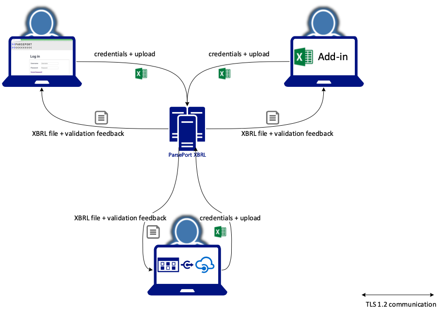

# Data handling
A typical data flow for the ParsePort XBRL service has the following four steps:

1. Upload your data to ParsePort ([TLS 1.2](../tls))
   - Use your credentials or token ([SAML 2.0](../identity))
   - Data is placed in memory
2. ParsePort extract and convert data from your upload
   - The conversion starts, time to live for a conversion is maximum 2 hours
3. You can download the report from ParsePort ([TLS 1.2](../tls))
  - You have `15 minutes` to download the report after the conversion is completed
4. ParsePort cleans up and delete all data from memory

The four steps can be visualized like the following:

### Time to live in memory
All data handled by ParsePort will live for `15 minutes` after processing. If there is a need for having certain data available for longer than `15 minutes`, e.g. if you use our collaborated space, you can postpone the deletion with `15 minutes`,until you have finished your tasks.

## What data are stored when using ParsePort solutions
When uploading data to ParsePort all data handling are done in memory, and no physical files are stored at the servers. What is saved, is an `ID`, `user id` whom started the process and the `logs` for the processing of your data. The ID can be used for retrieve logs, in case an error happens, and we need to contact you, to solve the issue. When signing up for ParsePort services, you have to provide `Name`, `Address`, `E-mail`, `Phone` and `billing information`. The privacy policies for ParsePort is available here: [https://parseport.com/cookies-and-privacy-policy/](https://parseport.com/cookies-and-privacy-policy/)
